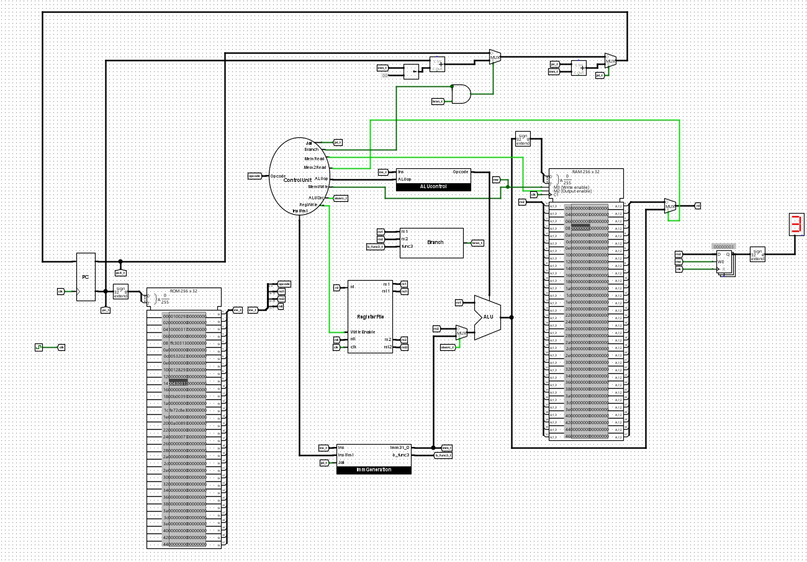

# Single-Cycle 32-bit RISC-V Processor with Counting Program



## Summary
This project features a fully functioning single-cycle 32-bit RISC-V processor designed in Logisim. It includes a counting program from 1 to 10, written in the Venus simulator, with machine code loaded into the CPU's ROM. The processor's output is connected to a hexadecimal segment display, showing the count during simulation.

## Table of Contents
- [Introduction](#introduction)
- [Features](#features)
- [Requirements](#requirements)
- [Installation](#installation)
- [Usage](#usage)
- [Custom Machine Code](#custom-machine-code)
- [Project Structure](#project-structure)
- [Contributing](#contributing)
- [License](#license)

## Introduction
This project demonstrates the implementation of a single-cycle 32-bit RISC-V CPU using Logisim. The CPU executes a program that counts from 1 to 10, and the result is displayed on a hexadecimal segment display.

## Features
- Single-cycle 32-bit RISC-V CPU
- Program counting from 1 to 10
- Hexadecimal segment display for output visualization

## Requirements
- [Logisim Evolution](https://github.com/logisim-evolution/logisim-evolution)
- [Venus Simulator](https://github.com/ThaumicMekanism/venus)

## Installation
1. Clone this repository:
   ```sh
   git clone https://github.com/AsadMehmood18/Single-Cycle-32-bit-RISC-V-Processor-with-Counting-Program.git
   ```
2. Open the Logisim project file in Logisim Evolution.

## Usage
1. Write the counting program in the Venus simulator.
2. Generate the machine code and place it in the ROM of the CPU in Logisim Evolution.
3. Simulate the CPU in Logisim Evolution.
4. Observe the count displayed on the hexadecimal segment display.

## Custom Machine Code
To input and run your own machine code:
1. Write your RISC-V assembly code in the Venus simulator.
2. Run the code in Venus to generate the machine code.
3. Open the Logisim Evolution project file (`CPU.circ`).
4. Double-click on the ROM component to open its properties.
5. Manually enter the generated machine code into the ROM's content.
6. Save the project and simulate the CPU in Logisim Evolution.
7. Your custom program will now run on the CPU, and the output will be displayed on the hexadecimal segment display.

## Project Structure
- `RIsCV32.circ` - Logisim project file
- `count1to10` - Machine code for counting program
- `README.md` - Project documentation

## Contributing
Contributions are welcome! Please open an issue or submit a pull request for any improvements or additions.

## License
This project is licensed under the MIT License. See the [LICENSE](LICENSE) file for details.
